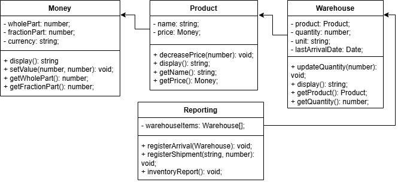

## Programming principles

1. YAGNI: The current design implements only those functions that are necessary to solve the task at hand. In each class, we implement only the necessary methods.
2. DRY: We avoid code duplication by reusing methods. For example, the display() method is implemented in multiple classes to show object information without repeating logic.
3. KISS: The code is simple and easy to understand. We focus on writing clear, short methods and avoid complicated solutions.
For example, [decreasePrice](./src/product.ts#L12-L20) method decrease price of product:
```typescript
decreasePrice(amount: Money) {
  const totalCentsCurrent =
    this.price.getWholePart() * 100 + this.price.getFractionalPart();
  const totalCentsAmount =
    amount.getWholePart() * 100 + amount.getFractionalPart();
  const newTotalCents = totalCentsCurrent - totalCentsAmount;

  this.price.setValue(Math.floor(newTotalCents / 100), newTotalCents % 100);
}
```
4. Composition Over Inheritance: Instead of using long chains of inheritance, we build objects by combining smaller, reusable parts. For example, [the Warehouse class holds Product objects](./src/warehouse.ts#L4).
5. Single Responsibility Principle (SRP): Each class does one job. For example, Money deals with money, Product manages product details, and Warehouse handles stock.
6. Liskov Substitution Principle (LSP): We can replace a class with its child class without breaking the system.
7. Open/Closed Principle (OCP): We can add new features without changing the existing code. For example, new products can be added without changing the current system.

## UML Class diagram

